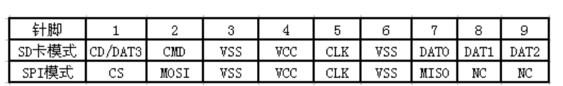
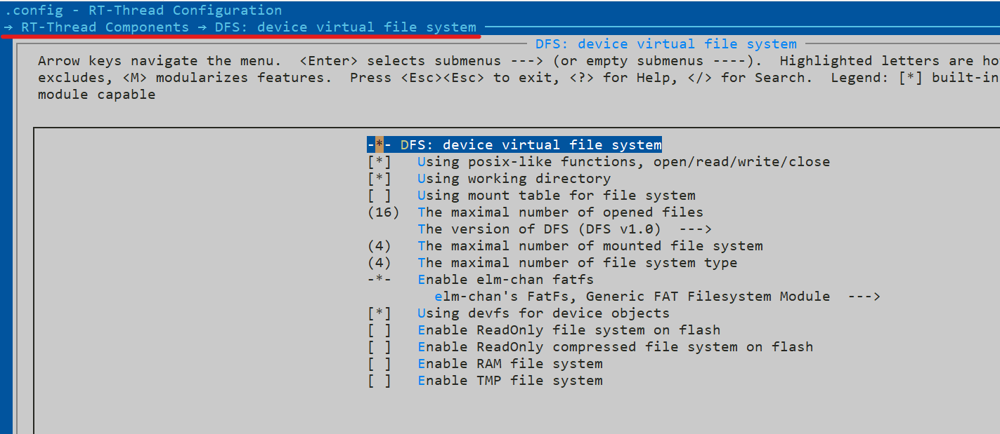
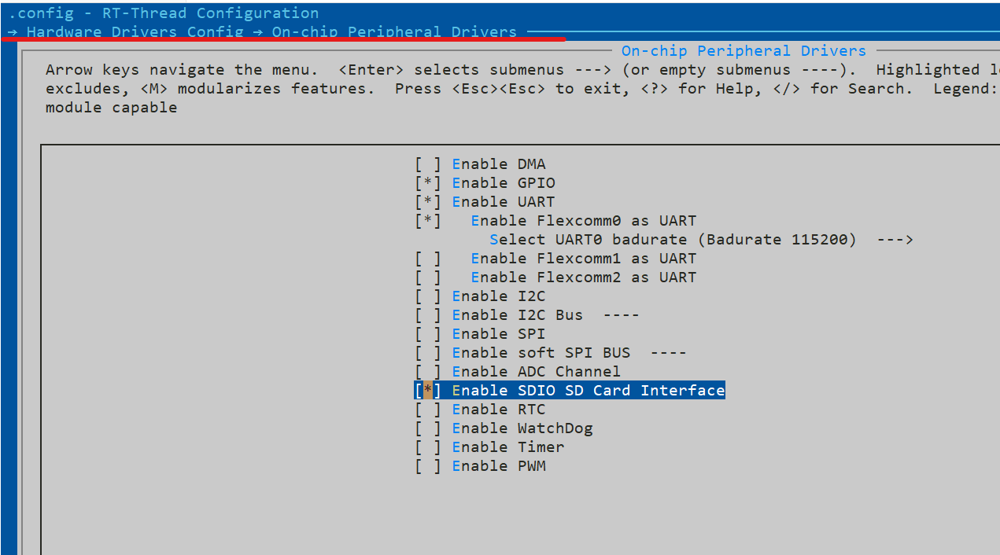
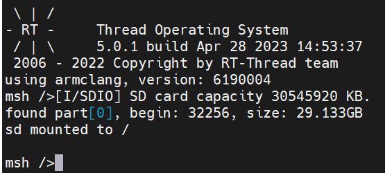
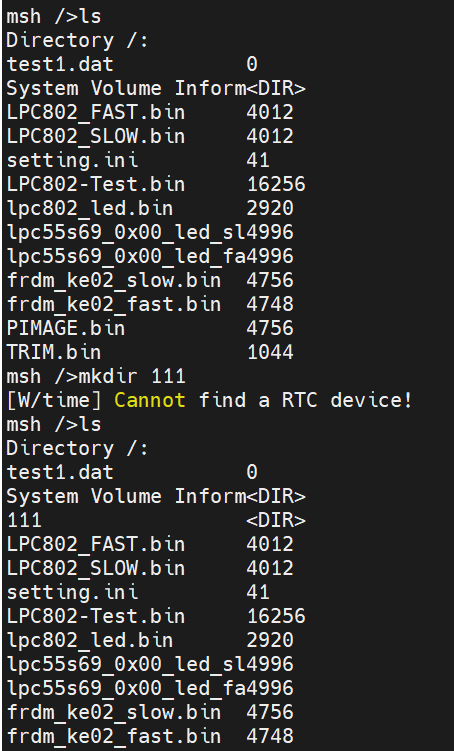

# RTT SD卡学习笔记

## SD 简介：

**SD**：（secure digital memory card）是一种安全存储器件。属性是快闪存储器（flash eeprom），功能用来存储数据

驱动 SD 卡主要有两种模式： SD （SDIO）模式和 SPI 模式。各模式接口定义如下

SDIO 模式下，是使用四个引脚作为数据传输（可以使用1 bit SD低速模式）；SPI 模式下，仅有一个引脚作为数据传输。可以看出，SPI 模式下，带宽是不如 SDIO 模式下的，但是 SPI 模式对硬件的要求较低。

## SDIO 模式：

SDIO 接口是在 SD 卡协议基础上发展而来的一种 IO 接口规范，它不但兼容 SD 卡，还可以用来连接 SD I/O 接口的设备。SDIO 协议可以实现 1 bit SD 低速和 4 bit SD 高速模式（传输数据的引脚数不同），传输数据时**低字节在前，高字节在后，但每个字节中的数据高位在前，低位在后**。

SDIO 总线上的通信是通过传送**命令**和**数据**实现。**命令**（主机到卡）和**响应**（卡到主机）都是在 CMD 线上进行传输。响应又分为短响应（48bit）和长响应（136bit），**不同命令对应的响应不同**。

这次我使用的开发平台是 lpc55s69_nxp_evk ，rt-thread 中已经有较为完善的 BSP 支持了，在 menuconfig 中进行简单的配置以后即可将 SD 卡挂载到文件系统。

### 体验流程：

- 在 bsp 中进入 menuconfig 进行配置

- 退出保存后，生成 keil 工程，编译并下载
- 连接串口，即可看到 SD 卡成功挂载
- 可以通过命令行操作文件系统
- 更多 FinSH 命令和玩法可以参考 [虚拟文件系统 (rt-thread.org)](https://www.rt-thread.org/document/site/#/rt-thread-version/rt-thread-standard/programming-manual/filesystem/filesystem)

## SPI 模式：

这里不对 SPI 做过多介绍，本文主要记录学习 SDIO。